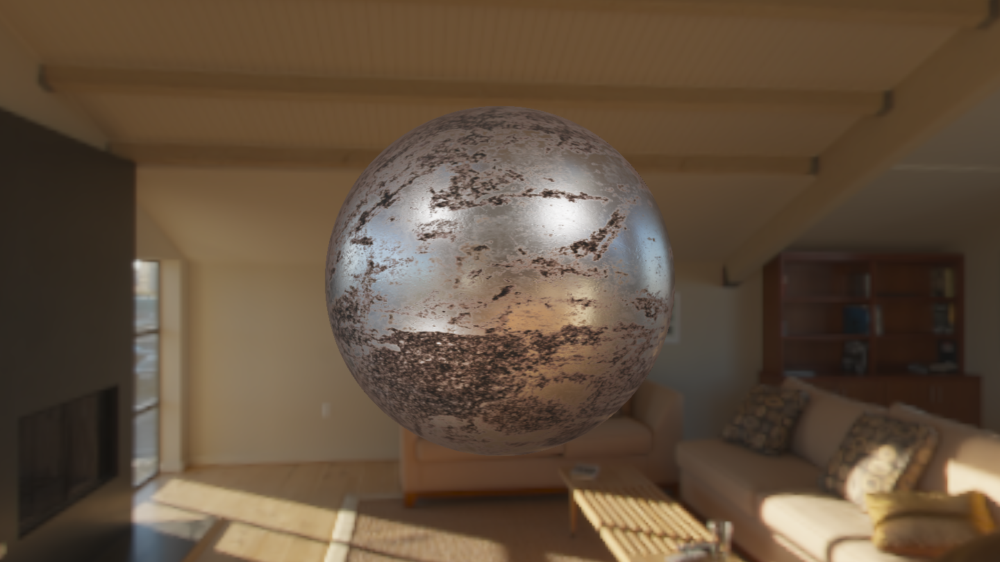

# DeferredShading
基于延迟渲染管线的、使用IBL实现环境光照的PBR渲染Demo。

# 主要内容
这个项目是学习LearnOpenGL网站的学习笔记形式的Demo。
将HDR图像转换为Cube Map并进行IBL的环境光照预滤波。
利用Epic Games的理论进行Microfacet BRDF模型的预积分。
在Deferred Shading Pipeline中如何从模型生成G-Buffer。
使用G-Buffer进行PRB光照渲染。
利用G-Buffer的深度图渲染Skybox。

# 渲染结果

